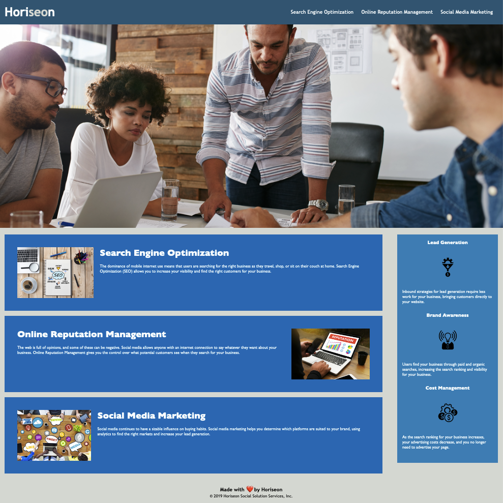

# Horiseon Semantic Tweaks

## Description

Horiseon Social Solutions, Inc. required a homepage that met accessibility standards. Including:

- Use of semantic HTML elements
- HTML elements that follow a logical structure independent of styling
- Uses of accessible alt attributes
- Heading elements which are in sequential order
- Use of a concise and descriptive title

## Installation

What are the steps required to install your project? Provide a step-by-step description of how to get the development environment running.

## Screenshot

## Final Product

[View Here](https://mcarson24.github.io/horiseon_semantic_tweaks/)

## License

This project is open-sourced software and is licensed under the terms of the [MIT License](https://opensource.org/licenses/MIT).

---